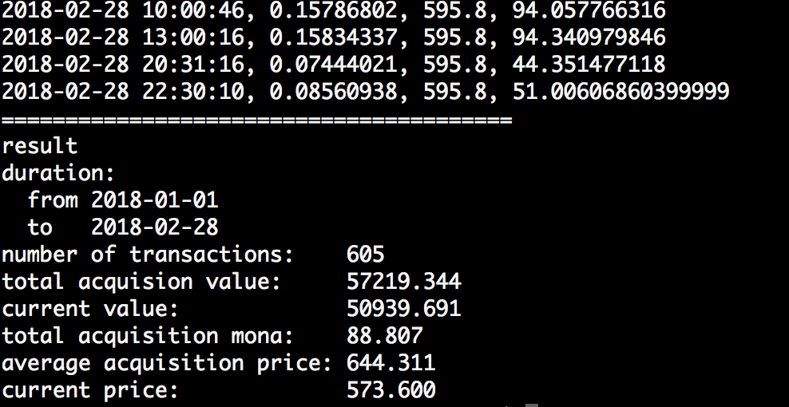
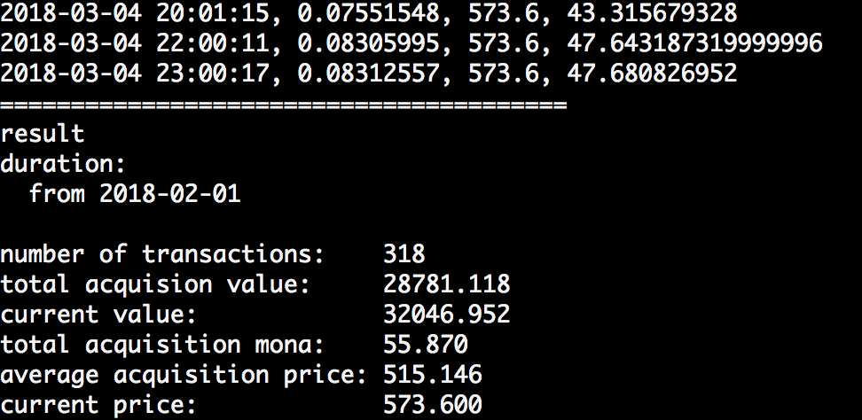

## 概要
モナコインのプールマインングの収益を計算するツールです。
温水プール用に作りましたが、vippool等のMPOSベースのAPIに互換があるプールなら動作するはずです。
APIから全てのトランザクションを取得し、取得した日の9時時点の価格をかけて、マイニング時の取得金額を算出します。



## 環境
* python3
* pip
    * requests
    * pandas

python2系,3系両対応です。
	
## 使い方
pandasとrequestsが必要なので、pipでインストールしておきます。

```
$ pip install requests pandas
```

pool.iniというファイルに使っているプール情報を入力します。
プールのurlと、API KEYを設定してください。

例
```pool.ini
[info]
pool_url=https://onsui-monacoin.xyz
api_key=12345678901234567890123456789012345678901234567890
```

API KEYは個人のアカウント設定ページで確認できます。他者に知られないように気をつけてください。

設定後、実行します。
実行は 

```
$ python main.py
```

トランザクション数、取得時の価値の合計、現在の価値、取得モナ数、平均取得価格、現在の価格を表示します。

number of transactions:    トランザクション数   
total acquision value:     取得時の価値の合計  
current value:             現在の価値  
total acquisition mona:    取得したモナ数  
average acquisition price: 平均取得価格  
current price:             現在の価格（９時時点）  

期間を指定したい場合は、以下のようにします。

```
$ python main.py --start 2018-01-01 --end 2018-02-28
```


--startだけ、endだけの指定も可能です。

```
$ python main.py --start 2018-02-01 

```



また、output.csvというファイルに詳細が出力されます。


## モナコインの価格の取得方法
cryptocpmpareというAPIを利用しています。
https://min-api.cryptocompare.com/

APIで取得できるデータが、2017年6月以降となるため、それ以前にマイニングした分の計算は正確に行われません。
確定申告等で2017年中の取得価格を計算したい場合は、こちらをお使いください
https://github.com/bohemian916/mona_pool_mining_value/tree/python3

